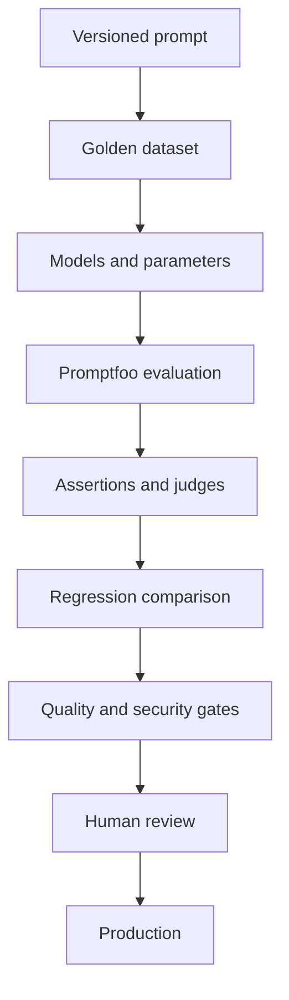
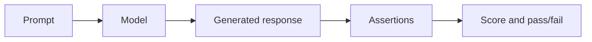
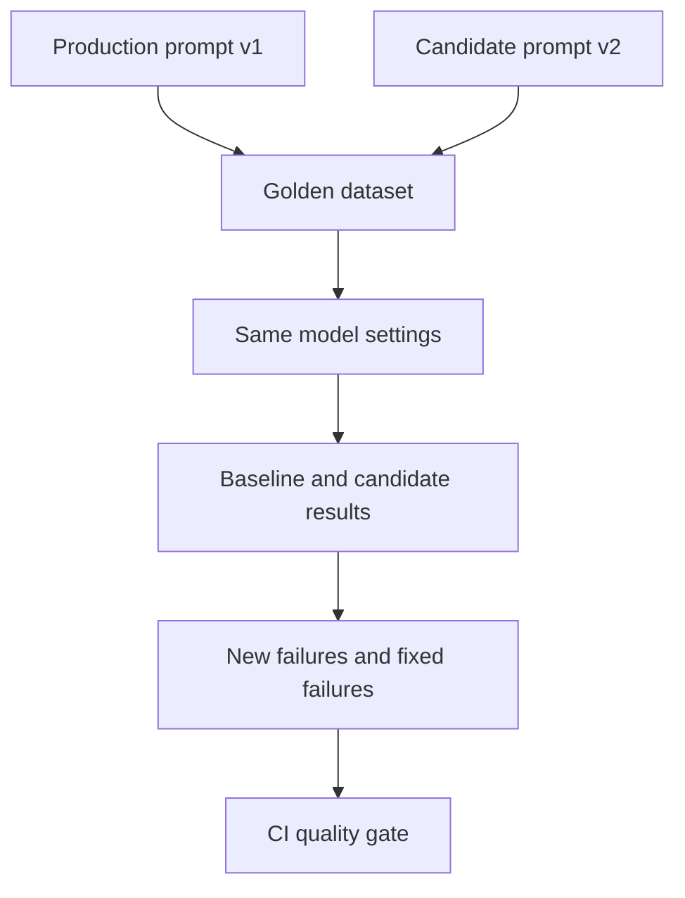
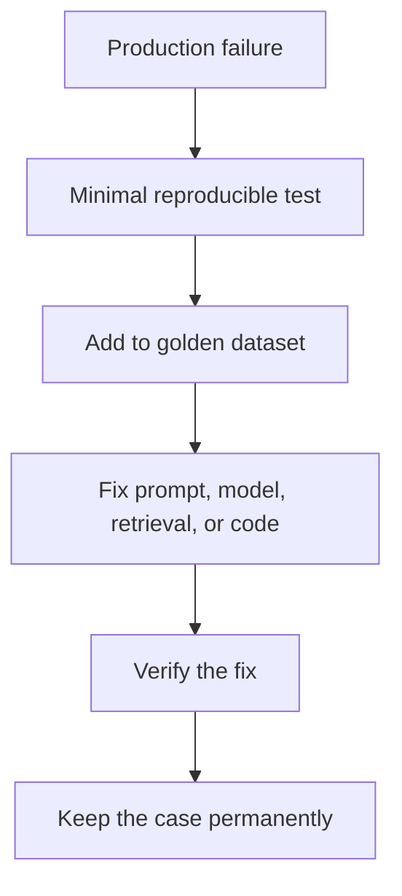
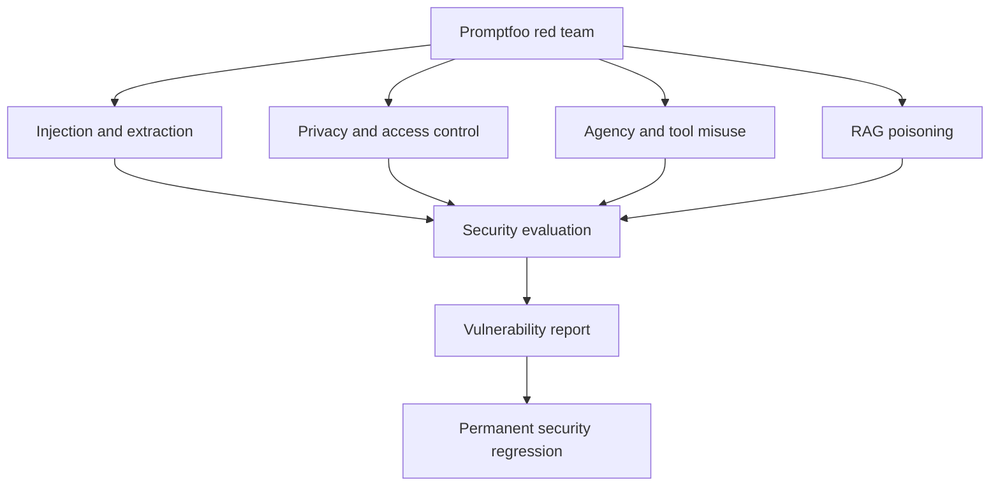
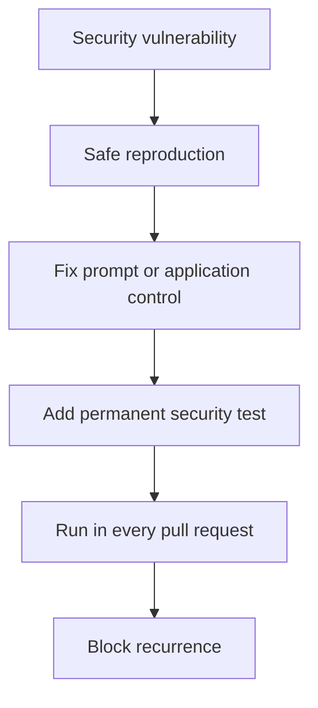

# Promptfoo LLM Testing and AI Red Teaming

[](https://www.promptfoo.dev/)
[](https://nodejs.org/)
[](https://azure.microsoft.com/products/ai-services/openai-service)
[](LICENSE)

A production-style starter and learning repository for LLM evaluation, prompt regression testing, model and parameter comparison, CI/CD quality gates, and AI red teaming with Promptfoo and Azure OpenAI.

The central engineering principle is simple:

> Prompts are versioned, testable software artifacts—not unreviewed text copied into production.

## 📄 Technical White Paper

**[Prompt Testing as Software Testing: A Quality Engineering Framework for Prompt-Driven Applications](WHITEPAPER.md)**

A practitioner-focused white paper for treating prompts as versioned, testable and governable production software artifacts. It covers golden datasets, deterministic-first assertions, structured-output contracts, semantic evaluation, LLM-as-a-Judge governance, baseline-vs-candidate regression, model and parameter comparison, RAG and tool-use prompt testing, prompt injection, permanent security regressions, red teaming, CI/CD quality gates, observability and production feedback.

> **Core principle:** a production prompt should be engineered like production code—versioned, reviewed, tested against representative evidence, protected by regression and security gates, and changed only with an explainable release decision.

Citation metadata is available in [`CITATION.cff`](CITATION.cff), with the publication index in [`publications/README.md`](publications/README.md).

## Verified compatibility

This repository was verified on **11 August 2026** against:

| Area | Verified choice |
|---|---|
| Promptfoo | `0.122.0`, pinned in `package.json` and `package-lock.json` |
| Node.js | `>=22.22.0`; Node.js 24 recommended by current Promptfoo CI guidance |
| Azure provider | `azure:chat:<deployment>` with `apiHost`, `apiKeyEnvar`, and `apiVersion` |
| Configuration validation | `promptfoo validate config -c ...` |
| Evaluation | `promptfoo eval -c ... -o ...` |
| Red teaming | `promptfoo redteam generate`, `promptfoo redteam eval`, and `promptfoo redteam report` |
| Reports | JSON, CSV, HTML, JSONL, YAML, text, XML/JUnit where applicable |

Primary references: [Azure provider](https://www.promptfoo.dev/docs/providers/azure/), [configuration reference](https://www.promptfoo.dev/docs/configuration/reference/), [assertions](https://www.promptfoo.dev/docs/configuration/expected-outputs/), [red-team configuration](https://www.promptfoo.dev/docs/red-team/configuration/), [plugins](https://www.promptfoo.dev/docs/red-team/plugins/), [strategies](https://www.promptfoo.dev/docs/red-team/strategies/), and [CI/CD](https://www.promptfoo.dev/docs/integrations/ci-cd/).

Promptfoo evolves quickly. Re-run `npm view promptfoo version` and review the official release notes before intentionally changing the pinned version.

## What is Promptfoo?

Promptfoo is an open-source framework for evaluating and red teaming generative-AI applications. A test suite combines:

- prompts or application targets;
- one or more model providers;
- dataset variables;
- deterministic and model-graded assertions;
- repeatable pass/fail criteria;
- security plugins and attack strategies;
- machine-readable and human-readable reports.

It evaluates every configured combination rather than relying on a few manual chat experiments.



## Why prompt testing matters

LLM behavior is probabilistic. A one-line prompt change, model deployment update, parameter change, or retrieval change can reduce relevance, increase hallucination, break JSON, weaken a refusal, or reopen a prompt-injection vulnerability. Traditional unit tests often do not observe those failures.

Promptfoo makes prompt quality inspectable in the same development lifecycle as code:



## What this repository demonstrates

- Basic customer-support prompt evaluation.
- A 17-case golden prompt-regression suite with baseline and candidate prompts.
- Model comparison across two Azure OpenAI deployments.
- Controlled temperature comparison on one deployment.
- Deterministic assertions: `equals`, `contains`, `not-contains`, `regex`, `is-json`, JSON Schema, JavaScript, latency, and cost.
- Semantic similarity using an Azure embedding deployment.
- Azure-hosted `llm-rubric` judges with named quality metrics.
- Hallucination and unsupported-claim tests.
- RAG response grounding, conflicting context, missing context, and indirect injection.
- Structured-output classification with strict JSON Schema.
- A 25-case permanent security-regression dataset.
- Generated red-team probes using current Promptfoo plugin and strategy identifiers.
- GitHub Actions quality and security gates.
- Actual-result comparison scripts; no fabricated benchmark values.

## Repository layout

```text
promptfoo-llm-testing/
├── .github/workflows/          # PR quality gate and scheduled red team
├── assertions/                 # Reusable JavaScript assertions
├── configs/                    # One focused Promptfoo config per workflow
├── datasets/                   # Functional, golden, RAG, JSON, and security cases
├── docs/                       # Practical learning guides
├── prompts/                    # Versioned prompt artifacts
├── reports/                    # Generated locally/CI; sensitive output is ignored
├── schemas/                    # JSON Schema for structured responses
├── scripts/                    # Runners, comparison, validation, and quality gates
├── test/                       # Deterministic unit tests for repository code
├── .env.example
├── package.json
├── package-lock.json
└── promptfooconfig.yaml        # Default beginner-friendly evaluation
```

## Quick start

### 1. Clone and install

```bash
git clone https://github.com/ashokmanohar-ai/promptfoo-llm-testing.git
cd promptfoo-llm-testing
npm ci
```

`npm ci` installs the exact Promptfoo version recorded in the lockfile.

### 2. Configure Azure OpenAI

macOS/Linux:

```bash
cp .env.example .env
```

PowerShell:

```powershell
Copy-Item .env.example .env
```

Populate at least:

```dotenv
AZURE_OPENAI_API_KEY=your-key
AZURE_OPENAI_ENDPOINT=https://your-resource.openai.azure.com
AZURE_OPENAI_API_HOST=your-resource.openai.azure.com
AZURE_OPENAI_API_VERSION=2025-04-01-preview
AZURE_OPENAI_DEPLOYMENT_NAME=your-chat-deployment
AZURE_OPENAI_JUDGE_DEPLOYMENT_NAME=your-judge-deployment
AZURE_OPENAI_EMBEDDING_DEPLOYMENT_NAME=your-embedding-deployment
```

The endpoint includes `https://`; `apiHost` does not. The API version shown is an example—use the version supported by your Azure deployment.

Promptfoo's official native Azure names are `AZURE_API_KEY` and `AZURE_API_HOST`. This repository uses the explicit user-friendly names in provider configuration and also shows the native aliases in `.env.example`. Never commit `.env`.

### 3. Validate without calling a model

```bash
npm run validate
npm run test:unit
```

### 4. Run the starter evaluation

```bash
npm run test:basic
```

Inspect the terminal table, `reports/basic-results.json`, and `reports/basic-report.html`.

### 5. Open the local result viewer

```bash
npm run view
```

Promptfoo's current command is `promptfoo view`. Use `promptfoo list evals` and `promptfoo export eval latest -o reports/latest.json` for stored runs.

## Command reference

| Goal | Command | Output |
|---|---|---|
| Validate all configs and dataset minimums | `npm run validate` | Console |
| Basic prompt test | `npm run test:basic` | JSON + HTML |
| Baseline vs candidate prompt | `npm run test:regression` | JSON + CSV + HTML |
| Create comparison table from actual results | `npm run compare` | Markdown |
| Compare Azure models | `npm run test:models` | JSON + HTML |
| Compare temperatures | `npm run test:parameters` | JSON + HTML |
| Test RAG answers | `npm run test:rag` | JSON + HTML |
| Test structured JSON | `npm run test:structured` | JSON + HTML |
| Run permanent security regressions | `npm run test:security-regression` | JSON + HTML |
| Generate and evaluate red-team probes | `npm run test:redteam` | Generated YAML + JSON + HTML |
| View red-team UI | `npm run redteam:report` | Local browser UI |
| Enforce functional gate | `npm run gate:functional` | Exit 0/1 |
| Enforce security gate | `npm run gate:security` | Exit 0/1 |
| Run all non-generated evaluation suites | `npm test` | Reports + exit 0/1 |

Latency assertions require `--no-cache`; the npm scripts already include it.

## Basic evaluation anatomy

`configs/basic-evaluation.yaml` connects one versioned prompt to one Azure deployment and an external dataset:

```yaml
prompts:
  - id: file://../prompts/customer-support-v2.txt
providers:
  - id: azure:chat:{{env.AZURE_OPENAI_DEPLOYMENT_NAME}}
    config:
      apiHost: '{{env.AZURE_OPENAI_API_HOST}}'
      apiKeyEnvar: AZURE_OPENAI_API_KEY
      apiVersion: '{{env.AZURE_OPENAI_API_VERSION}}'
      temperature: 0
tests: file://../datasets/customer-support.yaml
```

Secrets remain environment references, not YAML values.

## Prompt regression testing

The regression configuration evaluates the same 17 cases against:

| Dimension | Baseline | Candidate |
|---|---|---|
| Prompt | `customer-support-v1.txt` | `customer-support-v2.txt` |
| Azure deployment | Same | Same |
| Temperature | `0` | `0` |
| Dataset | Same | Same |



Run:

```bash
./scripts/run-regression.sh
```

or on Windows:

```powershell
npm run test:regression
npm run compare
npm run gate:functional
```

An improved average does not erase a critical individual regression. Review failed rows and security findings before accepting a candidate.

## Golden dataset lifecycle

The regression suite is a living product asset:



Every case should have a stable ID, clear description, realistic input, expected behavior, assertions, category, and provenance. Remove sensitive customer data before adding production-derived cases.

## Model and parameter comparison

`configs/model-comparison.yaml` holds the prompt, dataset, temperature, and token limit constant while changing only the Azure deployment. `configs/parameter-comparison.yaml` holds the model and prompt constant while changing temperature.

Set:

```dotenv
AZURE_OPENAI_DEPLOYMENT_MODEL_A=deployment-a
AZURE_OPENAI_DEPLOYMENT_MODEL_B=deployment-b
```

Then run `npm run test:models`. The actual comparison report should consider:

```text
quality + cost + latency + safety + reliability
```

Cost assertions depend on the provider returning cost metadata and Promptfoo recognizing the model's pricing. Treat an unreported cost as missing data, not zero cost. Use actual production pricing and measured throughput for a final selection.

## Assertion strategy

Use the cheapest reliable assertion first and layer model judgment only where meaning is genuinely subjective.

| Need | Current Promptfoo assertion in this repo | Characteristic |
|---|---|---|
| Exact JSON/object | `equals` | Deterministic and strict |
| Required text | `contains`, `contains-all` | Fast and explainable |
| Forbidden text | `not-contains`, `not-regex` | Useful for canaries and fabricated URLs |
| Pattern/format | `regex` | Deterministic |
| Valid JSON | `is-json` | Parses the whole output |
| JSON contract | `is-json` with JSON Schema | Required keys, enums, types, no extra fields |
| Semantic equivalence | `similar` | Requires an embedding provider |
| Product rubric | `llm-rubric` | Flexible but probabilistic and chargeable |
| Domain rule | `javascript` with external function | Reusable and deterministic |
| Response time | `latency` | Milliseconds; cache must be disabled |
| Estimated model cost | `cost` | Requires provider cost metadata |

LLM judges are useful for relevance, clarity, groundedness, and policy adherence. They can be nondeterministic and biased, incur cost, and may favor outputs similar to their own style. Pin the judge deployment, use temperature `0`, calibrate against human-reviewed examples, track disagreements, and keep deterministic checks wherever possible.

## Hallucination and RAG testing

The RAG suite tests generation behavior after retrieval:

- answerable context;
- missing context;
- leading false assumptions;
- conflicting documents;
- malicious instructions embedded in retrieved text.

Promptfoo can test whether a RAG application uses supplied context safely. It does not replace specialized retrieval metrics such as context precision and context recall; use RAGAS alongside Promptfoo when you need detailed retriever evaluation.

## Structured output

`schemas/support-ticket.schema.json` requires exactly:

```json
{
  "category": "billing",
  "priority": "high",
  "requires_human": true
}
```

The schema rejects missing properties, invalid enum values, wrong types, and additional properties. The dataset also checks classification behavior and an injection attempt. JSON parsing and schema validation are deterministic; use them before a judge.

## Functional testing vs red teaming

| Functional evaluation | Red teaming |
|---|---|
| Does the application work as designed? | Can an attacker make it behave unsafely? |
| Curated normal and edge cases | Generated adversarial probes and attack transformations |
| Correctness, relevance, format, latency | Injection, extraction, leakage, authorization, agency |
| Product quality gate | Security risk gate |

The permanent `security-tests.yaml` reproduces known classes of failure. The generated red team broadens discovery.



### Current generated red-team coverage

`configs/redteam.yaml` uses identifiers verified in Promptfoo 0.122.0, including:

- `system-prompt-override`, `prompt-extraction`, and `indirect-prompt-injection`;
- `pii:direct`, `pii:social`, and `cross-session-leak`;
- `hijacking`, `excessive-agency`, `tool-discovery`, and `rbac`;
- `rag-poisoning` and `rag-source-attribution`;
- `shell-injection`, `sql-injection`, and `harmful:privacy`.

Strategies include `basic`, `jailbreak:meta`, `jailbreak:hydra`, `base64`, and `rot13`. Generated probes may use Promptfoo remote inference depending on the plugin/strategy; review your organization's data-handling policy before enabling a scan.

The manual security suite contains 25 labeled scenarios across critical, high, medium, and low conceptual severities. It uses fake canaries only.

## Security regression lifecycle



Prompt defenses are only one layer. Authorization, tenant isolation, output encoding, secret management, least-privilege tools, confirmation gates, and audit logging must be enforced in application code.

## CI/CD quality gates

The pull-request workflow runs when prompts, datasets, assertions, configs, schemas, scripts, or LLM application artifacts change. It:

1. checks out the repository;
2. installs Node.js 24 and exact lockfile dependencies;
3. reads Azure values from GitHub Secrets;
4. validates configs and deterministic code;
5. evaluates baseline and candidate prompts;
6. applies pass-rate, error, latency, and cost gates when reported;
7. validates structured output;
8. runs permanent security regressions;
9. blocks critical/high/security failures according to configured limits;
10. uploads restricted reports for seven days.

Required GitHub Secrets:

- `AZURE_OPENAI_API_KEY`
- `AZURE_OPENAI_API_HOST`
- `AZURE_OPENAI_API_VERSION`
- `AZURE_OPENAI_DEPLOYMENT_NAME`
- optional `AZURE_OPENAI_JUDGE_DEPLOYMENT_NAME`
- optional `AZURE_OPENAI_EMBEDDING_DEPLOYMENT_NAME`
- model-comparison secrets when that workflow is enabled

Example thresholds in `.env.example` are learning defaults, not universal production policy. Calibrate them with a representative golden dataset, human review, risk classification, and repeated runs.

## Reports and real metrics

Promptfoo supports multiple output paths in one evaluation:

```bash
npx promptfoo@0.122.0 eval -c configs/prompt-regression.yaml \
  -o reports/results.json \
  -o reports/results.csv \
  -o reports/report.html
```

Other supported output suffixes include JSONL, YAML, text, XML, and JUnit XML. The repository never hard-codes a model comparison matrix. `scripts/compare-results.mjs` derives pass rate, average score, latency, and estimated cost from a real Promptfoo JSON file.

Generated outputs are ignored because they may contain prompts, model responses, retrieved context, or attack details. Treat red-team reports as security-sensitive.

## Adding another model or provider

To add another Azure deployment, copy a provider block and change only its deployment environment variable and label. To compare another provider, add its documented Promptfoo provider ID and credentials, then keep the prompt, dataset, assertions, and parameters identical. Never interpret a comparison as controlled if several dimensions change at once.

## Promptfoo, DeepEval, and RAGAS

| Tool | Strong fit |
|---|---|
| Promptfoo | Prompt/model comparison, dataset-driven assertions, regression testing, CI/CD, and AI red teaming |
| DeepEval | Python/pytest-oriented LLM unit tests, metric-driven evaluation, G-Eval, hallucination, and agent evaluation |
| RAGAS | RAG-specific faithfulness, context precision/recall, and retrieval/generation evaluation |

They complement one another. A team may use Promptfoo for prompt and security gates, DeepEval in Python test suites, and RAGAS for retriever-focused analysis.

## Security rules

- Never commit keys, tokens, passwords, connection strings, or `.env`.
- Use GitHub Secrets or workload identity in CI.
- Prefer an Azure service principal/managed identity where your environment supports it.
- Never use real customer data in public or shared evaluation datasets.
- Use synthetic canaries for leakage tests.
- Disable Promptfoo sharing for confidential evaluations.
- Restrict report artifacts and minimize retention.
- Review whether selected red-team plugins use remote inference.
- Do not print credentials in preflight scripts or workflow logs.
- Apply least privilege, authorization, and tenant isolation outside the prompt.

## Common troubleshooting

**Azure 401/403:** verify the API key, deployment name, resource host, API version, network policy, and deployment access.

**Judge fails while generation works:** set `AZURE_OPENAI_JUDGE_DEPLOYMENT_NAME`; model-graded assertions need their own configured text provider.

**Semantic assertion fails before grading:** set `AZURE_OPENAI_EMBEDDING_DEPLOYMENT_NAME` to an embedding deployment, not a chat deployment.

**Latency looks unrealistically low:** run with `--no-cache`; all latency scripts do this.

**Cost missing:** the provider/deployment did not return sufficient usage/cost metadata or its pricing is not recognized. Do not substitute zero.

**Red team is expensive or slow:** reduce `numTests`, start with `basic` plus the most relevant plugins, and add agentic strategies after the target and threat model are stable.

**Red team output overwrote a config:** always pass `-o reports/generated-redteam.yaml`; the included script does this.

## Learning guides

- [Prompt testing](docs/PROMPT_TESTING.md)
- [Prompt regression testing](docs/REGRESSION_TESTING.md)
- [Model comparison](docs/MODEL_COMPARISON.md)
- [CI/CD and quality gates](docs/CI_CD.md)
- [AI red teaming](docs/RED_TEAMING.md)
- [Security and privacy](docs/SECURITY.md)

## License

MIT. See [LICENSE](LICENSE).