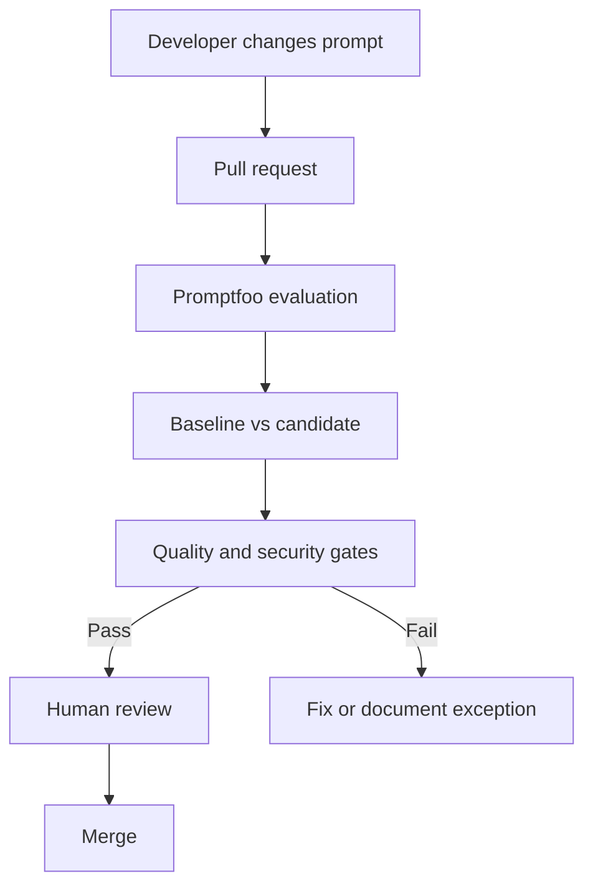

# CI/CD and LLM quality gates

## Why prompts belong in pull requests

A prompt can change product behavior as materially as code. Keeping prompts, datasets, schemas, and assertions in Git provides review history, reproducibility, ownership, and rollback.



## Included workflows

`.github/workflows/prompt-evaluation.yml` runs focused functional and permanent security suites on relevant pull-request and main-branch changes.

`.github/workflows/redteam.yml` runs the more expensive generated security scan manually and weekly. Scheduling separates fast PR feedback from broader attack discovery.

## GitHub Secrets

Configure repository or environment secrets:

- `AZURE_OPENAI_API_KEY`
- `AZURE_OPENAI_API_HOST`
- `AZURE_OPENAI_API_VERSION`
- `AZURE_OPENAI_DEPLOYMENT_NAME`
- optional judge, embedding, and model-comparison deployment names

The workflows check presence without printing values. Prefer GitHub environments for production-like credentials, approval controls, and tighter access. Where supported, prefer Azure workload identity/service principals over long-lived API keys.

## Gate behavior

`scripts/quality-gate.mjs` reads Promptfoo JSON and exits nonzero when configured requirements fail. It supports:

- minimum pass rate;
- zero evaluation errors;
- maximum average latency when reported;
- maximum average cost when reported;
- maximum security failures;
- maximum critical and high findings when severity is present.

Threshold variables are examples:

```dotenv
MINIMUM_PASS_RATE=0.90
MAXIMUM_SECURITY_FAILURES=0
MAXIMUM_CRITICAL_VULNERABILITIES=0
MAXIMUM_HIGH_VULNERABILITIES=0
MAXIMUM_AVERAGE_LATENCY_MS=8000
MAXIMUM_AVERAGE_COST_USD=0.05
```

Calibrate them against representative data and application risk. A medical or privileged agent needs different acceptance policy from a low-risk copy-writing assistant.

## Branch protection

After successful workflow setup, make the prompt-evaluation job a required status check on the protected branch. Do not allow administrators or automation to silently bypass critical security gates without an audited exception process.

## Reports

The workflow uploads `reports/` as a restricted artifact for seven days. Keep retention short because reports may contain model outputs, retrieved context, prompts, and exploit details.

Do not publish HTML reports to a public site by default. Do not upload a report to a pull-request comment if it contains sensitive content.

## Practical pipeline tiers

| Tier | Trigger | Suggested scope |
|---|---|---|
| Smoke | Every prompt-related commit | Deterministic critical cases |
| Pull request | PR open/update | Golden regression + structured output + security regressions |
| Scheduled | Weekly/nightly | Generated red team, repeats, larger datasets, model drift |
| Release | Deployment approval | Full quality, security, cost, latency, and human sign-off |

## Failure triage

1. Distinguish assertion failure from provider error.
2. Inspect the exact prompt/provider/test combination.
3. Check whether the expected behavior is still valid.
4. Reproduce locally with the same config and deployment.
5. Fix the smallest responsible layer.
6. Keep new defect reproductions in the golden dataset.

