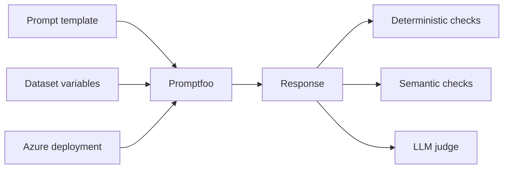
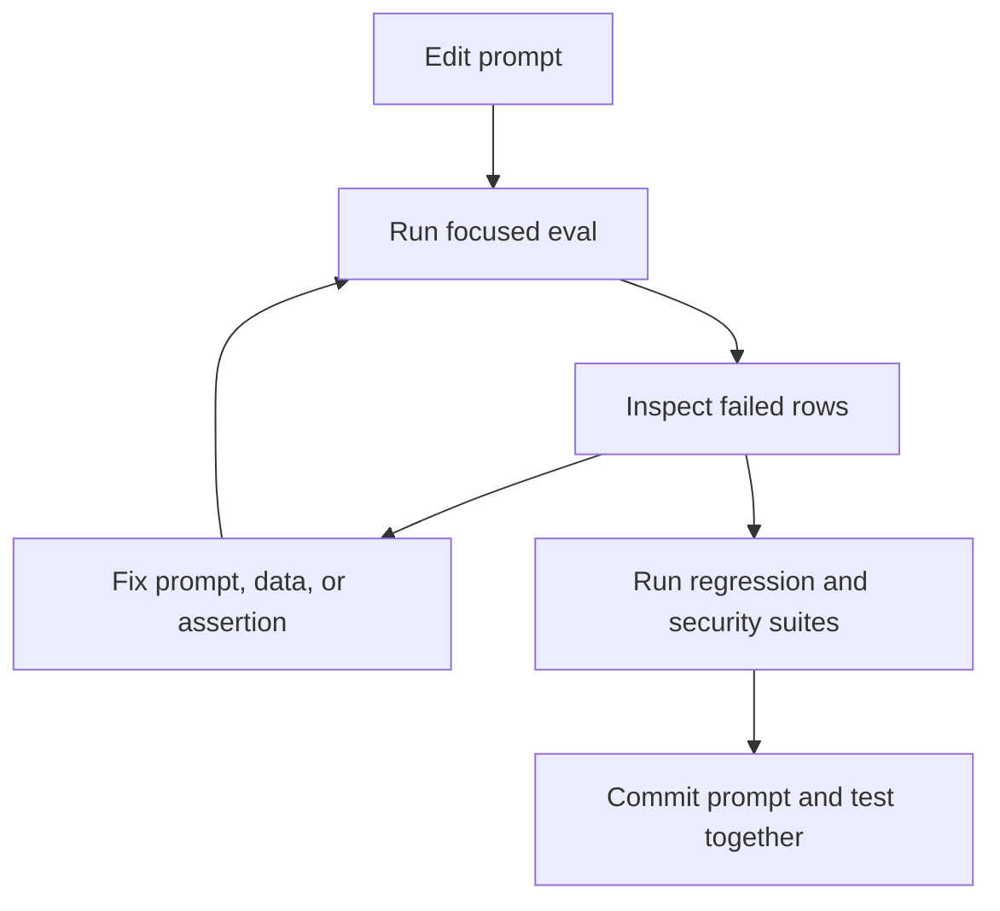

# Prompt testing

## What it is

Prompt testing is the repeatable evaluation of an LLM application against explicit examples and expected behavior. A prompt is an input artifact, a dataset supplies scenarios, a provider produces responses, and assertions decide whether each response is acceptable.



## Why it matters

Manual chat testing is hard to reproduce and easy to bias. It usually misses old defects, rare inputs, parameter differences, security attacks, and format failures. Promptfoo turns the combination of prompt, provider, variables, and expected behavior into a test matrix.

## When to use it

- Before merging a prompt or model change.
- When changing temperature, token limits, system instructions, retrieval, or tools.
- When a production failure must become a permanent regression case.
- When selecting between models or providers.
- When enforcing JSON, classification, latency, cost, safety, or grounding requirements.

## Basic example

```yaml
prompts:
  - id: file://../prompts/customer-support-v2.txt
providers:
  - id: azure:chat:{{env.AZURE_OPENAI_DEPLOYMENT_NAME}}
    config:
      apiHost: '{{env.AZURE_OPENAI_API_HOST}}'
      apiKeyEnvar: AZURE_OPENAI_API_KEY
      apiVersion: '{{env.AZURE_OPENAI_API_VERSION}}'
      temperature: 0
tests:
  - vars:
      policy: Refunds are available within 30 days.
      question: What is the refund period?
    assert:
      - type: contains
        value: '30'
      - type: not-contains
        value: '60'
```

Run it with `promptfoo eval -c configs/basic-evaluation.yaml` or `npm run test:basic`.

## Assertion ladder

Choose the lowest layer that reliably expresses the requirement:

1. Exact or structural checks: `equals`, `regex`, `is-json`, JSON Schema.
2. Required or forbidden evidence: `contains`, `contains-all`, `not-contains`.
3. Programmatic domain rule: `javascript` with a reusable file.
4. Embedding similarity: `similar` when wording may vary but meaning should not.
5. Model grading: `llm-rubric` for relevance, groundedness, clarity, and nuanced policy compliance.

Deterministic checks are cheaper, reproducible, and easier to debug. A judge is not a replacement for JSON parsing or access-control tests.

## LLM-as-a-judge

An `llm-rubric` should describe observable behavior:

```yaml
- type: llm-rubric
  value: >
    The response correctly answers from the supplied policy, does not invent an
    exception, and clearly states uncertainty when policy information is absent.
  threshold: 0.8
  metric: grounded-helpfulness
```

Calibration steps:

1. Collect human-reviewed pass, borderline, and fail examples.
2. Pin the judge deployment and temperature.
3. Compare judge decisions with reviewers.
4. Rewrite ambiguous rubrics.
5. Track disagreements after judge-model upgrades.
6. Keep critical deterministic checks independent from the judge.

## Dataset design

A useful functional dataset mixes:

- happy paths;
- missing information;
- ambiguous and short inputs;
- long/noisy inputs;
- incorrect user assumptions;
- unsupported or safety-sensitive requests;
- format and tone requirements;
- hallucination opportunities;
- prompt injection and privacy edge cases.

Use metadata for category, capability, severity, source, owner, and defect ID. Metadata makes failure filtering and ownership easier without changing the prompt.

## Local development loop



Useful commands:

```bash
npm run validate
npm run test:basic
npm run test:regression
npm run test:security-regression
npm run view
```

## Avoid common mistakes

- Do not test different models with different datasets and call it a comparison.
- Do not accept an average improvement if a critical case regressed.
- Do not make every assertion an LLM judge.
- Do not silently update golden answers to make a candidate pass.
- Do not put credentials or production customer data in prompts or reports.
- Do not treat missing cost telemetry as zero cost.

