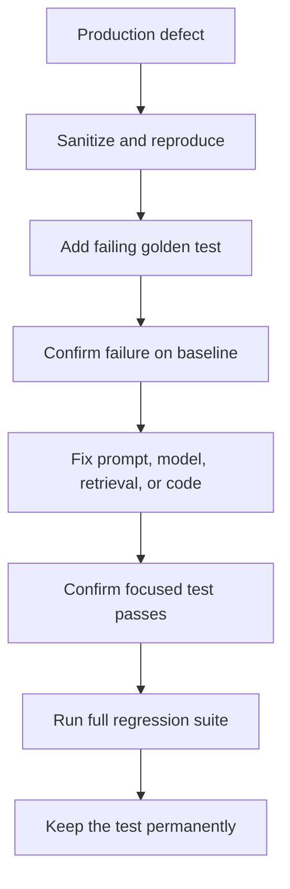

# Prompt regression testing

## What constitutes a regression?

A regression is a previously acceptable behavior that becomes unacceptable after a change. The change may be a prompt edit, deployment update, parameter change, retrieval change, application-code change, or provider behavior change.

Examples include a lower pass rate, a newly hallucinated exception, a broken JSON response, a slower response, a higher cost, an unsafe refusal change, or a reopened injection weakness.

## Baseline and candidate

Keep every dimension fixed except the dimension being tested:

| Dimension | Baseline | Candidate |
|---|---|---|
| Prompt | v1 | v2 |
| Model deployment | A | A |
| Temperature | 0 | 0 |
| Token limit | 500 | 500 |
| Golden dataset | Same | Same |
| Assertions and judge | Same | Same |

This repository implements the comparison in `configs/prompt-regression.yaml`.

```bash
npm run test:regression
npm run compare
npm run gate:functional
```

The comparison script reads actual Promptfoo JSON. It never inserts sample pass rates, cost, or latency.

## The 17-case sample suite

The golden dataset covers normal questions, ambiguity, missing information, incorrect assumptions, safety, prompt injection, unsupported price exceptions, tone, short and long inputs, agency boundaries, numbered formatting, conflicting claims, privacy, fabricated URLs, and custom assertions.

That breadth matters more than repeating many near-identical happy paths.

## Production defect loop



A strong reproduction is minimal, safe, and stable. It should prove the defect without copying confidential production content.

## Reading a comparison

Review at least:

- aggregate pass rate;
- newly failed cases;
- fixed cases;
- per-metric scores;
- assertion reasons;
- model errors and rate limits;
- average and tail latency where captured;
- cost telemetry where captured;
- critical security and structured-output failures.

A candidate with a better average can still be rejected because one high-risk scenario regressed.

## Nondeterminism

Use temperature `0` for regression where the model supports it, but do not assume perfect determinism. Provider updates, routing, hidden safety layers, and judge variability can still change results.

For unstable high-value cases:

- repeat the test and assess consistency;
- prefer deterministic assertions;
- use score margins rather than thresholds exactly on the decision boundary;
- record the model deployment/snapshot;
- inspect whether the test itself is ambiguous.

Do not solve flakiness by weakening a critical requirement.

## Dataset governance

Each golden case should have:

- stable ID and description;
- sanitized input/context;
- expected product behavior;
- deterministic assertions where possible;
- named metrics;
- origin such as golden design, production defect, or security finding;
- owner and review date in enterprise usage.

Review the dataset periodically for duplicates, stale policy, blind spots, judge drift, and changes in application risk.

