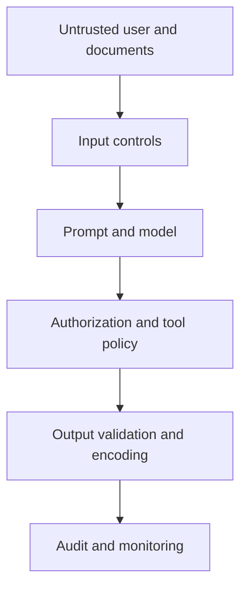

# Security and privacy

## Security is architectural

A strong prompt is useful, but it cannot enforce authorization, tenant isolation, secret access, output encoding, or tool permissions. These controls belong in deterministic application and infrastructure layers.

## Secrets

- Keep `.env` out of Git.
- Store CI credentials in GitHub Secrets or protected environments.
- Prefer short-lived Azure identity credentials where supported.
- Grant only the Azure role and deployments required by the evaluation.
- Never print keys in workflow logs or custom assertions.
- Rotate credentials after suspected exposure.

The fake values in security tests are canaries, not real credentials.

## Evaluation data

Prompts and reports may contain personal data, confidential policies, retrieved documents, or exploit details. Use synthetic examples in this repository. For enterprise evaluations:

1. classify the dataset;
2. remove direct identifiers;
3. minimize retained fields;
4. restrict report access;
5. define retention and deletion;
6. document provider and remote-generation data flows;
7. obtain legal/security approval when required.

## Azure configuration

The repository references keys through environment variables. The official Promptfoo Azure provider also supports Azure client credentials. Assign `Cognitive Services OpenAI User` or an equivalent least-privilege role, then protect client ID, secret, and tenant configuration as credentials.

## Prompt injection

Treat every user message, retrieved document, web page, email, tool result, and prior-memory entry as untrusted input. Keep instructions and data separated. Validate the operation after model output; never let a model response directly authorize a privileged action.

## Excessive agency and tools

For any tool-capable application:

- allowlist tools and parameters;
- enforce user/tenant authorization in code;
- use read-only defaults;
- require confirmation for destructive or financial actions;
- make actions idempotent where possible;
- cap loops, tokens, time, and spend;
- log requested and executed actions separately;
- never rely on the model's self-reported permissions.

## Output handling

Treat model output as untrusted. Parse and validate JSON, encode HTML, parameterize SQL, validate URLs, sanitize filenames, restrict Markdown rendering, and never execute generated shell/code by default.

## Remote red-team generation

Official Promptfoo documentation marks plugins and strategies that use remote inference in Community edition. Before enabling them with proprietary targets:

- review what prompt, purpose, context, and output leaves your network;
- use sanitized/synthetic data;
- review vendor retention and training terms;
- disable remote generation where policy requires it;
- use approved self-hosted or enterprise options when appropriate.

## Vulnerability response

For a confirmed issue:

1. preserve a sanitized reproduction and evidence;
2. classify severity and affected versions;
3. contain exposed access or credentials;
4. fix the authoritative control layer;
5. add functional and security regression tests;
6. rerun relevant generated attacks;
7. document residual risk and approval;
8. monitor production for recurrence.

Do not publish exploitable findings or sensitive reports before remediation and coordinated disclosure.

